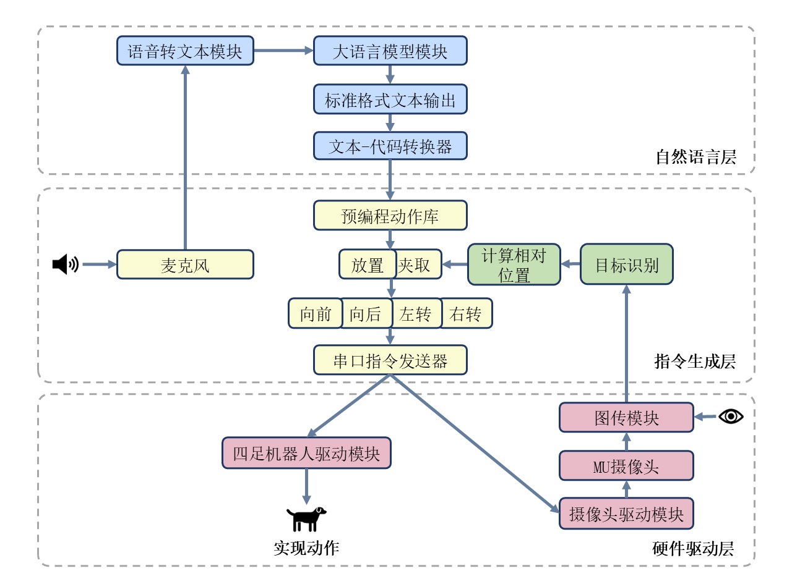
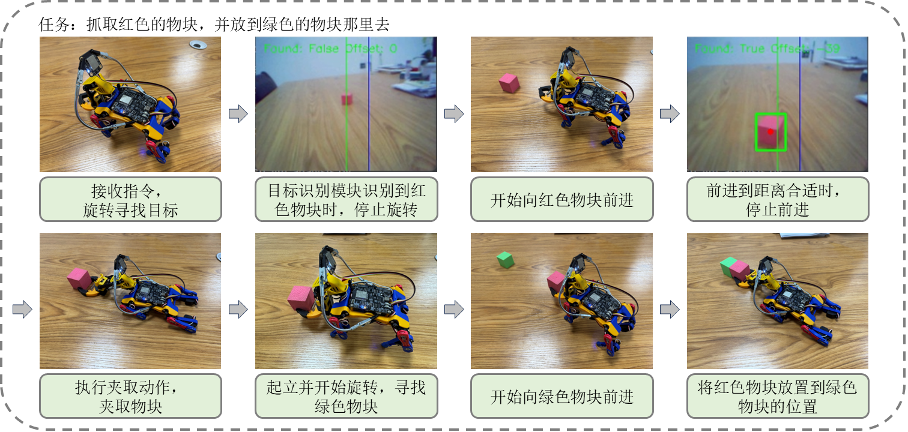

# 基于LLM的四足机器人物资搬运系统
## 项目简介
我的毕业设计项目，使用大语言模型分解来自语音的任务，指导四足机器人进行物资搬运。
使用语音转文本API将语音指令转化为文本，使用大语言模型API将任务拆解为预编程的指令， 
将指令通过蓝牙串口发送给四足机器人。四足机器人上运行有作者修改的OpenCatEsp32开发框架，
内置了机器人的各项驱动。关于开发框架的源码，参见[此处](https://github.com/PetoiCamp/OpenCatEsp32)。



## 如何使用
### 驱动部分，强烈建议在进行开发前通读[Petoi的文档](https://docs.petoi.com/chinese?fallback=true)。

下载`drive_firmware`后在Arduino中打开其中的`OpenCatEsp32.ino`，
请**务必**参考[此处](https://docs.petoi.com/chinese/arduino-ide/wei-biboard-shang-chuan-cheng-xu)的文档进行配置并下载库。
确保一切配置完成和机器人正确校准后，将机器人连接到PC并在Arduino上载固件。

注意：
1. 请使用本项目中提供的驱动**而非OpenCatEsp32程序**，否则可能由于端口不对应导致机器人损坏；
2. 请确保在Arduino下载了包括但不限于MUVisionSensor3、ArduinoJson的库；
3. 建议下载[桌面驱动程序](https://github.com/PetoiCamp/OpenCat/tree/main/pyUI)方便固件上载；
4. MU摄像头的详细文档可以参考[此处](https://morpx-docs.readthedocs.io/zh-cn/latest/MUVS3/introduction.html)。

### PC部分
`pc_controller`是运行在PC端的代码，使用`Python 3.11.7`编写， 请参照`requirement.txt`配置对应的环境或直接运行：

   ```bash
   pip install -r requirements.txt
   ```

环境配置完毕后，请在`.env.example`文件中填入你使用的在线大语言模型和语音模型的`apikey`并将文件名称改为`.env`。
作为参考，我使用的大模型是[SiliconFlow](https://cloud.siliconflow.cn/sft-bnajv5sqab/models)的DeepSeek-V3，语音识别模型是[百度短语音识别极速版](https://cloud.baidu.com/product/speech/asrpro)。
如果使用不同的模型，请参照官网修改`stt_llm_analysis.py`中的相关API调用格式。

### 硬件连接
请将MU摄像头排线插到机器人左后方的插口，机械臂排线插到右后方的插口。
打开机器人，确认MU摄像头供电并且工作在WiFi模式，使用电脑连接`MORPX_MU`热点和`Bittle_BLE`蓝牙。
在设置查看蓝牙使用的端口填入`.env`中（一般为COM5）。为了在连接热点的同时连接互联网，请插网线。

连接热点后，可以在浏览器输入`http://192.168.4.1`检查图传是否正常。

以上配置完成后，运行`stt_llm_analysis.py`。向机器人说话，机器人应当能够执行相应的指令。


## 代码解释
`pc_controller/src`中，`stt_llm_analysis.py`包括语音转文本和大语言模型的API调用以及主程序入口，
`robot_control_set.py`包括预编程的动作库，`camera_calibration.py`是得到相机参数的程序，校准结果 
放在`calibration_results`中。

蓝牙代码在`drive_firmware/src/bleClient.h`和`bleUart.h`中，
基础的步态驱动在`InstinctBittleESP.h`中。请确保`OpenCat.h`中的`PWM_pin[PWM_NUM]`数组定义是：

   ```bash
   const uint8_t PWM_pin[PWM_NUM] = {
     19, 2, 4, 27,  // head or shoulder roll
     33, 5, 15, 14, // shoulder pitch
     32, 18, 13, 12 // knee
};
   ```
## 其他
非常感谢Petoi Bittle团队提供的开源框架、硬件设备以及在开发过程中的帮助。 
欢迎大家关注[PetoiCamp](https://github.com/PetoiCamp)。